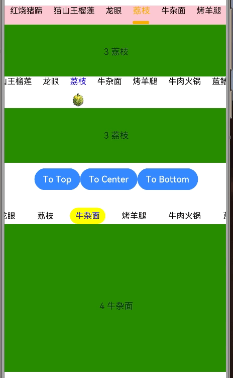
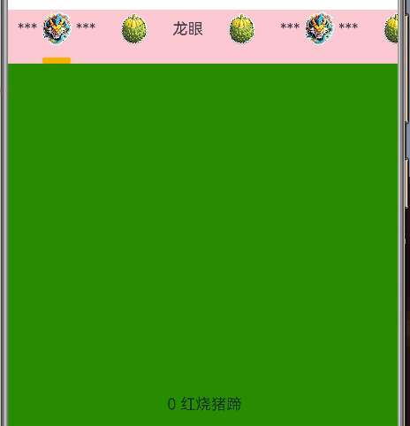
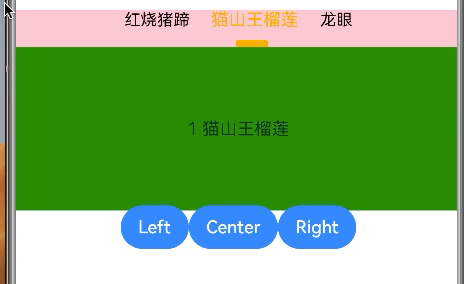
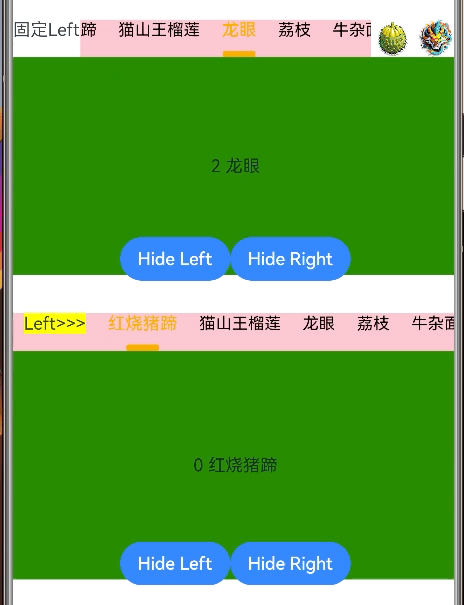
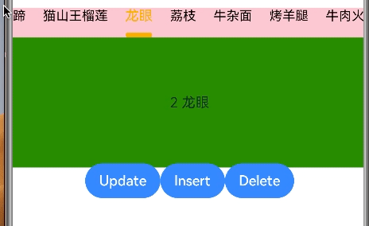

# PJTabBar

## 简介
PJTabBar是一个用于替换系统Tabs的控件，支持自定义指示器，Tabbar item, Tabbar item的布局(居左居中居右), Tabbar的左右附加额外视图等


## 效果展示:

**自定义指示器:**



**自定义Tabbar Item:**



**自定义Item的布局:**



**自定义Tabbar左右的附加视图:**



**更新插入删除自定义Tabbar Item:**




## 下载安装

````
ohpm install @piaojin/pjtabbar
````

OpenHarmony ohpm环境配置等更多内容，请参考[如何安装OpenHarmony ohpm包](https://gitee.com/openharmony-tpc/docs/blob/master/OpenHarmony_har_usage.md)

## 使用说明

可通过PJTabBarOptions自定义指示器视图，大小，间距，布局，样式等，也可自定义Tabbar Item视图， 左右附加视图等。并支持更新，添加，删除Tabbar Item。

````

1. 导入
import {PJTabComponent, PJTabBarItem, PJTabBarOptionsInterface, PJTabBarOptions} from '@ohos/pjtabbar'
(根据需要可导入PJTabBar，PJTabComponentController, PJTabBarOptions等)

2. PJTabComponent作为Tabs + TabContent使用，也可以单独使用不带Tab content的PJTabBar。

private options: PJTabBarOptionsInterface = new PJTabBarOptions()
this.options.indicatorWidth = 30
this.options.indicatorHeight = 6
this.options.indicatorColor= Color.Orange
this.options.tabBarBackGround = Color.Pink
this.options.selectedFontSize = 16
this.options.selectedFontColor = Color.Orange
this.options.tabBarContentMargin = {left: 10, right: 10}

PJTabComponent({
   items: this.items,
   tabBarOptions: this.options,
   contentBuilder: this.contentBuilder,
})

@Builder contentBuilder(item: PJTabBarItemInterface, index: number) {
   Text(index.toString() + ' ' + item.title)
    .width('100%')
    .height('100%')
    .textAlign(TextAlign.Center)
    .backgroundColor(Color.Green)
}
````

更多详细用法请参考开源库sample页面的实现

## PJTabBarOptions属性说明

| <font face="黑体" size=4>属性名</font>                 |                                                                                                                      <font face="黑体" size=4>说明</font> |
|:--------------------------------------------------|------------------------------------------------------------------------------------------------------------------------------------------------------:|
| `fontSize: number`                                |                                                                                                                                 item未选中状态下的字体大小,默认值15 |
| `selectedFontSize?: number`                       |                                                                                                                                  item选中状态下的字体大小,默认值15 |
| `fontColor: Color`                                |                                                                                                                        item未选中状态下的字体颜色，默认值Color.Black |
| `selectedFontColor: Color`                        |                                                                                                                          item选中状态下的字体颜色，默认值Color.Blue |
| `fontWeight: number ? FontWeight ? string`        |                                                                                                            item未选中状态下的字体Weight, 默认值FontWeight.Regular |
| `selectedFontWeight: number ? FontWeight ? string` |                                                                                                             item选中状态下的字体Weight, 默认值FontWeight.Regular |
| `fontStyle: FontStyle`                            |                                                                                                               item未选中状态下的字体Style, 默认值FontStyle.Normal |
| `selectedFontStyle: FontStyle`                    |                                                                                                                item选中状态下的字体Style, 默认值FontStyle.Normal |
| `fontFamily: string ？ Resource`                   |                                                                                                                                item字体的Family, 默认值为空'' |
| `textAlign: TextAlign = TextAlign.Center`         |                                                                                                                    item text对齐方式, 默认值TextAlign.Center |
| `itemBackgroundColor: Color`                      |                                                                                                                 item未选中状态下的背景颜色, 默认值Color.Transparent |
| `selectedItemBackgroundColor: Color`              |                                                                                                                  item选中状态下的背景颜色, 默认值Color.Transparent |
| `tabBarBackGround: Color = Color.White`           |                                                                                                                          整个TabBar的背景颜色，默认值Color.White |
| `itemSpace: number`                               |                                                                                                                                   每个item之间的间距,默认值20vp |
| `itemWidth?: number`                              |                                                                                                        每个item的固定宽度，默认值为null。如果未设置则item的宽度由item内容自适应宽度 |
| `itemHeight?: number`                             |                                                                                                        每个item的固定高度，默认值为null。如果未设置则item的高度由item内容自适应高度 |
| `itemBorder: BorderOptions`                       |                                                                                        item未选中状态下的border,默认值{radius: 0, width: 0, color: Color.White} |
| `selectedItemBorder: BorderOptions`               |                                                                                        item未选中状态下的border,默认值{radius: 0, width: 0, color: Color.White} |
| `itemMargin: Margin`                              |                                                                                                 item的Margin,默认值{top: 0, bottom: 0, left: 0, right: 0} |
| `itemAnimationDuration: number`                   |                                                                                                                       TabBar滚动到被选中的item的动画持续时间，默认值300 |
| `itemAlign: Alignment`                            |                                                                item在TabBar中水平位置的对齐方式(居左居中居右)，需要设置`isTabBarWidthFillParent = true`，默认值Alignment.Center |
| `tabBarVerticalAlign?: VerticalAlign`             |                                                                                                    item在TabBar中垂直方向的对齐方式(居上居中居下)，默认值VerticalAlign.Top |
| `maxLines: number`                                |                                                                                                                                   item text的最大行数,默认值1 |
| `indicatorWidth: number`                          |                                                                                                                                           指示器宽度，默认值20 |
| `indicatorHeight: number`                         |                                                                                                                                            指示器高度，默认值4 |
 | `indicatorBorderRadius: number`                   |                                                                                                                                            指示器圆角，默认值2 |
| `indicatorMargin: Margin`                         |                                                                                                  指示器Margin,默认值{top: 10, bottom: 0, left: 0, right: 0} |
| `indicatorColor: Color`                           |                                                                                                                                   指示器颜色，默认值Color.Blue |
| `indicatorAnimationDuration: number`              |                                                                                                                            指示器滚动到选中item的动画持续时间，默认值300 |
| `indicatorPosition: PJIndicatorPosition`          |                                                                                                指示器在item的位置(在item上，下，中间)，默认值PJIndicatorPosition.Bottom |
| `scrollStyle: PJScrollStyle = PJScrollStyle.Normal`|                                                                                                           指示器滚动的风格，目前只有Normal,即当选中其他item时指示器在选中后才滚动过去 |
| `isSameWidthWithItem: boolean`                    |                                                                                     设置指示器的宽度是否和item宽度一致，默认值false, 如果设置为true则对`indicatorWidth`属性的设置将无效 |
| `isSameHeightWithItem: boolean`                   |                                                                                    设置指示器的高度是否和item高度一致，默认值false, 如果设置为true则对`indicatorHeight`属性的设置将无效 |
| `isHideIndicator: boolean`                        |                                                                                                                                      是否隐藏指示器，默认值false |
| `scrollable: ScrollDirection`                     |                                                                                  TabBar滚动方向，设置为None时禁止滚动，即固定TabBar Item，默认值ScrollDirection.Horizontal |
| `isLeftItemFixed: boolean`                        |                                                                                                                             TabBar左侧附加视图是否固定住，默认值true |
| `isRightItemFixed: boolean`                       |                                                                                                                             TabBar右侧附加视图是否固定住，默认值true |
| `isLeftItemSameHeightWithTabBar: boolean`         |                                                                                                                     TabBar左侧附加视图高度是否和TabBar一致，默认值true |
| `isRightItemSameHeightWithTabBar: boolean`        |                                                                                                                     TabBar右侧附加视图高度是否和TabBar一致，默认值true |
| `isHideLeftItem: boolean`                         |                                                                                                                             是否隐藏TabBar左侧附加视图，默认值false |
| `isHideRightItem: boolean`                        |                                                                                                                             是否隐藏TabBar右侧附加视图，默认值false |
| `edgeEffect: EdgeEffect`                          |                                                                                                                 TabBar滚动到边缘的动画效果，默认值EdgeEffect.Spring |
 | `tabBarContentMargin: Margin`                     |                                                                                             TabBar内容的Margin,默认值{top: 0, bottom: 0, left: 0, right: 0} |
| `isTabBarWidthFillParent?: boolean`| TabBar宽度是否撑满父组件，默认值true。当设置true时`itemAlign`属性不起作用(居左居中居右)，此时TabBar宽度是自适应的，若单独使用PJTabBar可自行配合`Row() {PJTabBar}.justifyContent(FlexAlign)`达到居左，居中，居右效果。 |
| `shouldScrollToCurrentIndexWhenTabBarWidthChanged?: boolean`|                                                                                                TabBar宽度变化后(比如横竖屏切换)当选中的item不可见时是否自动滚动到选中的item，默认值true |
| `optimizeOffsetX: number`                         |                                                                                                    item被选中时滚动到item的附加偏移量，目的是让被选中的item尽量滚动到中间位置，默认值120 |
| `tabBarBorder?: BorderOptions`|                                                                                                          TabBar border配置，默认值null, 可用于配置iOS风格Segment组件 |

## 约束与限制

在下述版本验证通过：

- DevEco Studio 版本： DevEco Studio 3.1.1 Release(3.1.0.501)

- OpenHarmony SDK:API9 (3.2.12.5)

## 目录结构

````
|---- PJTabBar
|     |---- entry  # 示例代码文件夹
|     |---- pjtabbar_staticlibrary  # PJTabBar三方库核心文件夹
|           |----src
|                 |----main
|                       |----ets
|                             |----components
|                                   |----PJTabBar.ets #指示器的核心实现
|                                   |----PJTabComponent.ets #供开发使用，等于Tabs + TabContent
                              |----models
|                                   |----PJTabBarOptions.ets #包含各种配置项
|                                   |----其他.ets #其他model文件
|           |---- index.ets  # 对外接口
|     |---- README.md  # 安装使用方法
````

## 贡献代码

使用过程中发现任何问题都可以提 [Issue](https://gitee.com/weng-jinshan/PJTabBar/issues) 给我，当然，我也非常欢迎你给我发 [PR](https://gitee.com/weng-jinshan/PJTabBar/pulls) 。

## 开源协议

本项目基于 [Apache License 2.0](https://gitee.com/openharmony-sig/CircleIndicator/blob/master/LICENSE) ，请自由地享受和参与开源。

## 参考的ReadMe写法

[CircleIndicator README.md](https://gitee.com/openharmony-sig/CircleIndicator/blob/master/README.md)


## 下个版本计划

* 由于本人没有Next开发权限，故还没适配OpenHarmony SDK:API12， 将来计划适配。 
* 指示器跟随TabContent的滑动而联动。
